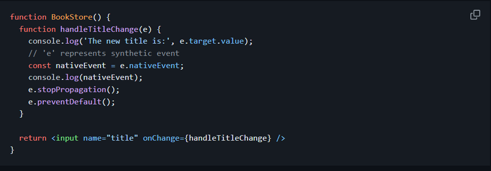
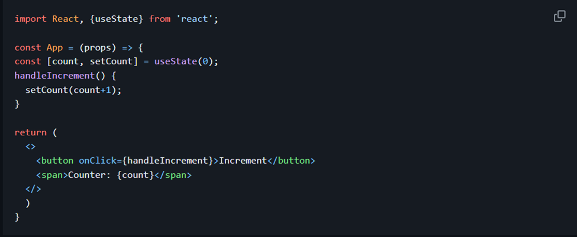
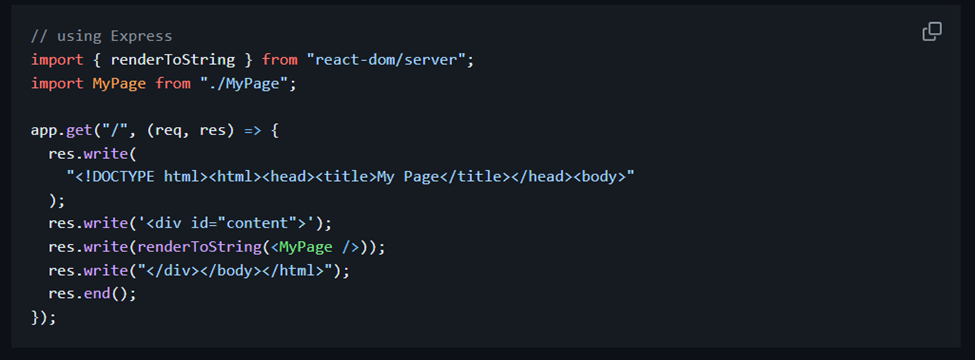
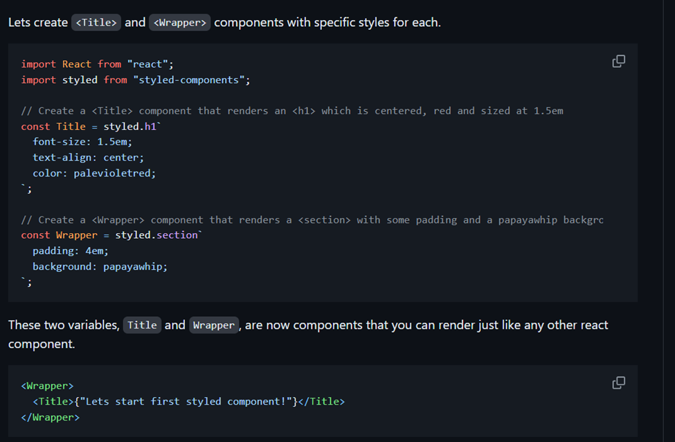
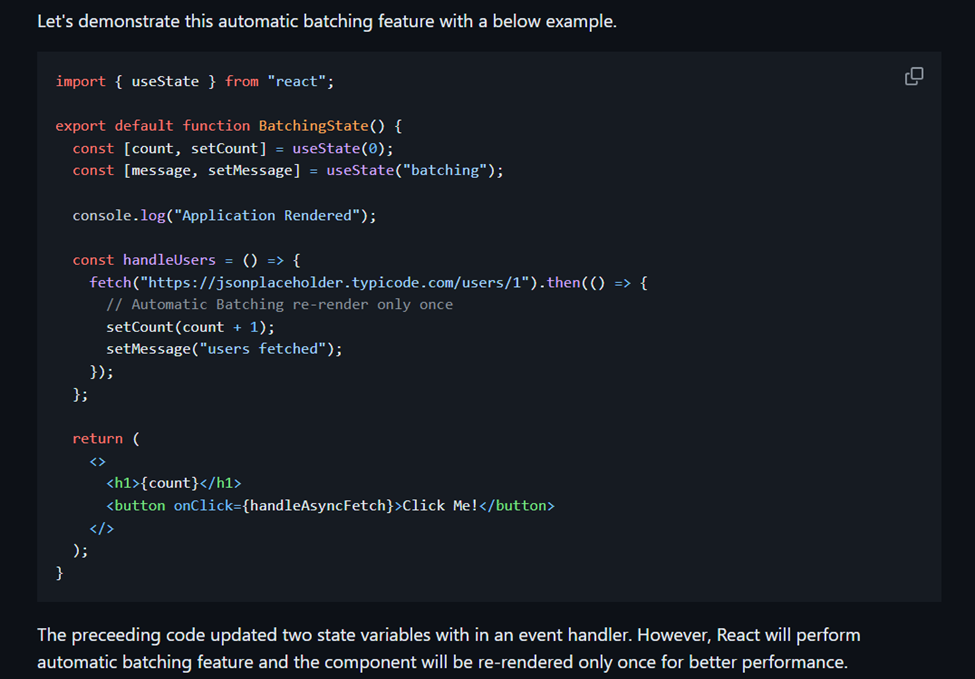

# React JS Notes

1. **Virtual DOM (VDOM)**
   - The Virtual DOM is an in-memory representation of the Real DOM.
   - The representation of a UI is kept in memory and synced with the "real" DOM.
   - This process, happening between the render function call and the displaying of elements, is called reconciliation.

2. **SyntheticEvent**
   - A cross-browser wrapper around the browser's native event.
   - Its API is the same as the native event, including `stopPropagation()` and `preventDefault()`, but works identically across all browsers.
   - Native events can be accessed directly from synthetic events using the `nativeEvent` attribute.
   

3. **Shadow DOM**
   - A browser technology designed primarily for scoping variables and CSS in web components.
   - The Virtual DOM is a concept implemented by libraries in JavaScript on top of browser APIs.

4. **Controlled Component**
   - Controls the input elements within forms based on user input.
   - Every state mutation has an associated handler function, keeping the displayed data in sync with the state of the component.
   - Implementation steps:
     1. Initialize the state using useState hooks in function components or inside the constructor for class components.
     2. Set the form element's value to the respective state variable.
     3. Create an event handler to handle user input changes using useState updater function or setState from class components.
     4. Attach the event handler to form elements' change or click events.

5. **Uncontrolled Components**
   - Store their own state internally and use a ref to find their current value when needed.
   - Implementation steps:
     1. Create a ref using useRef hook in function components or `React.createRef()` in class components.
     2. Attach this ref to the form element.
     3. Access the form element value directly through the ref in event handlers or `componentDidMount` for class components.

6. **Higher-Order Component (HOC)**
   - A function that takes a component and returns a new component, derived from React's compositional nature.
   - Called pure components because they can accept any dynamically provided child component without modifying or copying behavior from input components.
   - Usage examples:
     - Code reuse logic and bootstrap abstraction.
     - Render hijacking.
     - State abstraction and manipulation.
     - Props manipulation.

7. **Reconciliation**
   - The process through which React updates the Browser DOM to work faster.
   - React uses a diffing algorithm to make component updates predictable and faster.
   - React calculates the difference between the real DOM and the Virtual DOM during component updates, updating only the changed nodes.
   - React stores a copy of Browser DOM which is called Virtual DOM. When we make changes or add data, React creates a new Virtual DOM and compares it with the previous one. This comparison is done by Diffing Algorithm. Now React compares the Virtual DOM with Real DOM. It finds out the changed nodes and updates only the changed nodes in Real DOM leaving the rest nodes as it is. This process is called Reconciliation.

8. **JSX Attribute Naming**
   - Attribute names in JSX are turned into keys of JavaScript objects, requiring camelCase for compatibility.
   - `class` is a keyword in JavaScript, so React uses `className` instead.
   - Pass a string as the `className` prop.

9. **Portal**
   - Recommended for rendering children into a DOM node outside the parent component's DOM hierarchy.
   - Use `ReactDOM.createPortal(child, container)`.
   - The first argument is any renderable React child; the second argument is a DOM element.

10. **Stateless Component**
    - A component whose behavior is independent of its state can be a stateless component.


11. If the behaviour of a component is dependent on the state of the component then it can be termed as **Stateful component**. These stateful components are either function components with hooks or class components.
Let's take an example of function stateful component which update the state based on click event


12. The **react-dom** package provides DOM-specific methods that can be used at the top level of your app. Most of the components are not required to use this module. Some of the methods of this package are:
    - render()
    - hydrate()
    - unmountComponentAtNode()
    - findDOMNode()
    - createPortal()

13. The **ReactDOMServer** object enables you to render components to static markup (typically used on node server). This object is mainly used for server-side rendering (SSR). The following methods can be used in both the server and browser environments:
    - renderToString()
    - renderToStaticMarkup()
For example, you generally run a Node-based web server like Express, Hapi, or Koa and you call renderToString to render your root component to a string which you then send as response.


14. React is already equipped to handle rendering on Node servers. A special version of the DOM renderer is available which follows the same pattern as on the client side.
    ```javascript
    import ReactDOMServer from "react-dom/server";
    import App from "./App";
    ReactDOMServer.renderToString(<App />);
    ```
This method will output the regular HTML as a string which can be then placed inside a page body as part of the server response. On the client side, React detects the pre-rendered content and seamlessly picks up where it left off.

15. **Mixins** are a way to totally separate components to have a common functionality. Mixins should not be used and can be replaced with higher-order components or decorators.

16. **Shallow rendering** is useful for writing unit test cases in React. It lets you render a component one level deep and assert facts about what its render method returns without worrying about the behavior of child components which are not instantiated or rendered.

17. You can use **Context** in your application directly and is going to be great for passing down data to deeply nested components which what it was designed for.
Whereas **Redux** is much more powerful and provides a large number of features that the Context API doesn't provide. Also, React Redux uses context internally but it doesn't expose this fact in the public API.

18. **Reducers** always return the accumulation of the state (based on all previous and current actions). Therefore, they act as a reducer of state. Each time a Redux reducer is called, the state and action are passed as parameters. This state is then reduced (or accumulated) based on the action and then the next state is returned. You could reduce a collection of actions and an initial state (of the store) on which to perform these actions to get the resulting final state.

19. **redux-saga** is a library that aims to make side effects (asynchronous things like data fetching and impure things like accessing the browser cache) in React/Redux applications easier and better.

20. **Redux Thunk** middleware allows you to write action creators that return a function instead of an action. The thunk can be used to delay the dispatch of an action or to dispatch only if a certain condition is met. The inner function receives the store methods dispatch() and getState() as parameters.

21. Both **Redux Thunk and Redux Saga** take care of dealing with side effects. In most of the scenarios, Thunk uses Promises to deal with them, whereas Saga uses Generators. Thunk is simple to use and Promises are familiar to many developers, Sagas/Generators are more powerful but you will need to learn them. But both middleware can coexist, so you can start with Thunks and introduce Sagas when/if you need them.

22. **styled-components** is a JavaScript library for styling React applications. It removes the mapping between styles and components, and lets you write actual CSS augmented with JavaScript.


23. The concept of **render hijacking** is the ability to control what a component will output from another component. It means that you decorate your component by wrapping it into a Higher-Order component. By wrapping, you can inject additional props or make other changes, which can cause changing logic of rendering. It does not actually enable hijacking, but by using HOC you make your component behave differently.

24. Class components can be restricted from re-rendering when their input props are the same using PureComponent or shouldComponentUpdate. Now you can do the same with function components by wrapping them in **React.memo**.

```js
const MyComponent = React.memo(function MyComponent(props) {
  /* only rerenders if props change */
});

```

25. The **React.lazy** function lets you render a dynamic import as a regular component. It will automatically load the bundle containing the OtherComponent when the component gets rendered. This must return a Promise which resolves to a module with a default export containing a React component.
```js
const OtherComponent = React.lazy(() => import("./OtherComponent"));

function MyComponent() {
  return (
    <div>
      <OtherComponent />
    </div>
  );
}

```

26. You can compare the current value of the state with an existing state value and decide whether to rerender the page or not. If the values are the same then you need to return null to stop re-rendering otherwise return the latest state value.
For example, the user profile information is conditionally rendered as follows.
```js
getUserProfile = (user) => {
  const latestAddress = user.address;
  this.setState((state) => {
    if (state.address === latestAddress) {
      return null;
    } else {
      return { title: latestAddress };
    }
  });
};
```

27. **Hooks** is a special JavaScript function that allows you use state and other React features without writing a class. This pattern has been introduced as a new feature in React 16.8 and helped to isolate the stateful logic from the components.

28. The **defaultProps** can be defined as a property on the component to set the default values for the props. These default props are used when props not supplied(i.e., undefined props), but not for null props. That means, If you provide null value then it remains null value.
For example, let us create color default prop for the button component.
```js
function MyButton {
  // ...
}

MyButton.defaultProps = {
  color: "red",
};

```

29. When you declare a component as a function or a class, it must never modify its own props.
Let us take a below capital function.
```js
function capital(amount, interest) {
  return amount + interest;
}
```
The above function is called **“pure”** because it does not attempt to change their inputs, and always return the same result for the same inputs. Hence, React has a single rule saying "All React components must act like pure functions with respect to their props."

30. In React, it is recommended to use **composition over inheritance** to reuse code between components. Both Props and composition give you all the flexibility you need to customize a component’s look and behavior explicitly and safely. Whereas, If you want to reuse non-UI functionality between components, it is suggested to extract it into a separate JavaScript module. Later components import it and use that function, object, or class, without extending it.

31. With the release of React 18, React.lazy and Suspense are now available for server-side rendering. However, prior to React 18, it was recommended to use **Loadable** Components for code-splitting in a server-side rendered app because React.lazy and Suspense were not available for server-side rendering. Loadable Components lets you render a dynamic import as a regular component. For example, you can use Loadable Components to load the OtherComponent in a separate bundle like this:
```js
import loadable from "@loadable/component";

const OtherComponent = loadable(() => import("./OtherComponent"));

function MyComponent() {
  return (
    <div>
      <OtherComponent />
    </div>
  );
}

```
Now OtherComponent will be loaded in a separated bundle Loadable Components provides additional benefits beyond just code-splitting, such as automatic code reloading, error handling, and preloading. By using Loadable Components, you can ensure that your application loads quickly and efficiently, providing a better user experience for your users.

32. If the module containing the dynamic import is not yet loaded by the time parent component renders, you must show some fallback content while you’re waiting for it to load using a loading indicator. This can be done using Suspense component.
For example, the below code uses suspense component.
```js
const OtherComponent = React.lazy(() => import("./OtherComponent"));

function MyComponent() {
  return (
    <div>
      <Suspense fallback={<div>Loading...</div>}>
        <OtherComponent />
      </Suspense>
    </div>
  );
}
/// As mentioned in the above code, Suspense is wrapped above the lazy component.
```

33. React needs to use algorithms to find out how to efficiently update the UI to match the most recent tree. The **diffing algorithms** is generating the minimum number of operations to transform one tree into another. However, the algorithms have a complexity in the order of O(n³) where n is the number of elements in the tree.
In this case, displaying 1000 elements would require in the order of one billion comparisons. This is far too expensive. Instead, React implements a heuristic O(n) algorithm based on two assumptions:
- Two elements of different types will produce different trees.
- The developer can hint at which child elements may be stable across different renders with a key prop.

34. If you **create a function inside a render method**, it negates the purpose of pure component. Because the shallow prop comparison will always return false for new props, and each render in this case will generate a new value for the render prop. You can solve this issue by defining the render function as instance method.

35. **Windowing** is a technique that only renders a small subset of your rows at any given time, and can dramatically reduce the time it takes to re-render the components as well as the number of DOM nodes created. If your application renders long lists of data then this technique is recommended. Both react-window and react-virtualized are popular windowing libraries which provides several reusable components for displaying lists, grids, and tabular data.

36. The **ESLint plugin** enforces rules of Hooks to avoid bugs. It assumes that any function starting with ”use” and a capital letter right after it is a Hook. In particular, the rule enforces that,
- Calls to Hooks are either inside a PascalCase function (assumed to be a component) or another useSomething function (assumed to be a custom Hook).
- Hooks are called in the same order on every render

37. **Prop Drilling** is the process by which you pass data from one component of the React Component tree to another by going through other components that do not need the data but only help in passing it around.

38. Behind the scenes, JSX is transformed into plain javascript objects. It is not possible to return two or more objects from a function without wrapping into an array. This is the **reason you can't simply return two or more JSX tags from a function without wrapping them into a single parent tag or a Fragement**.

39. React prevents component from re-rendering for each and every state update by grouping multiple state updates within an event handler. This strategy improves the application performance and this process known as **batching**. The older version of React only supported batching for browser events whereas React18 supported for asynchronous actions, timeouts and intervals along with native events. This improved version of batching is called **automatic batching**.


40. **React hydration** is used to add client-side JavaScript interactivity to pre-rendered static HTML generated by the server. It is used only for server-side rendering(SSR) to enhance the initial rendering time and make it SEO friendly application. This hydration acts as a bridge to reduce the gap between server side and client-side rendering.
After the page loaded with generated static HTML, React will add application state and interactivity by attaching all event handlers for the respective elements.

41. The **useReducer Hook** is used to store and update states, just like the useState Hook. It accepts a reducer function as its first parameter and the initial state as the second. useReducer returns an array that holds the current state value and a dispatch function to which you can pass an action and later invoke it.

42. The **useContext** hook is used to consume values from a React context. Context provides a way to pass data through the component tree without having to pass props manually at every level.